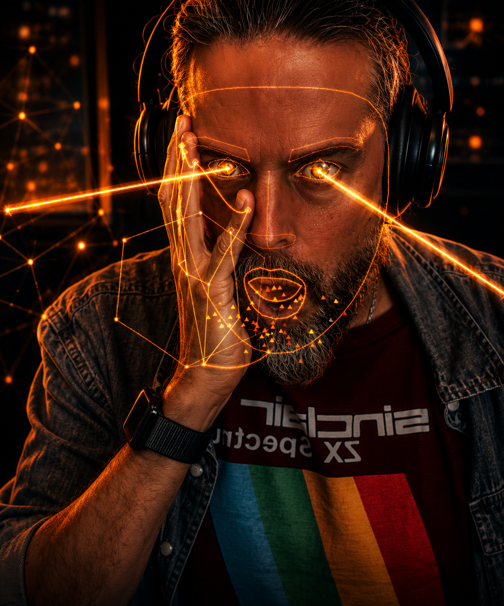

<div align="center">

# HandSynth

**A gestural synthesizer you play with your hands, mouth, and eyes.**

Move your hands, open your mouth, widen your eyes — a generative music brain responds in real time.
Cyberpunk visualizer · MediaPipe webcam tracking · Tone.js audio engine.



[]()
[]()
[]()

</div>

---

## What it is

A web app + Electron desktop app that turns your body into an expressive musical instrument. No keys, no knobs to learn — your hands, head, mouth, and eyes are the interface.

- **Hand position** sweeps the master filter
- **Hand height** drives note density and brightness
- **Hand openness** controls reverb, delay, drive, and resonance
- **Hand depth** (toward / away from camera) raises and lowers the master volume
- **Palm rotation** modulates brightness and grit
- **Pinch right** triggers a harmony-aware lead stab
- **Pinch left** advances the chord progression
- **Mouth open** sweeps delay wet, filter cutoff, reverb, and brightness simultaneously
- **Eyes wide** boosts reverb and filter resonance — and shoots Superman-style laser beams from your eyes
- **Smile / frown / surprise / anger** modulate brightness, cutoff, drive, and resonance — your face is the fourth controller
- **Both fists** mutes; **both hands above head** is the "drop"

The music brain stays inside the active scale — **it is impossible to play a wrong note** — and four built-in vibes (Tycho, Bonobo, Hopkins, Floating Points) set tonality, BPM, and timbre. Eight factory PATCH presets (LUSH, ACID, DUB, BRIGHT, DARK, TAPE, SPACE, INIT) flip whole-sound character with one click — each preset re-shapes the **oscillators and envelopes** of the pad/lead/bass voices on top of the FX chain, so they sound genuinely different (not just "same patch through different reverb"). Save your own patches to `localStorage`.

## Quick start (web)

```sh
pnpm install
pnpm dev
```

Open `http://localhost:5173`, click **Permetti webcam e iniziare**, raise your hands.

Tested in Chrome, Edge, Safari 15+, Firefox 114+. Webcam permission required.

## Desktop installers

```sh
# Windows .exe (NSIS installer with directory picker + shortcuts)
pnpm electron:build:win
# → release/HandSynth-Setup-0.1.0.exe (~87 MB)

# macOS .dmg (run on a Mac — cross-build from Windows is unreliable)
pnpm electron:build:mac
# → release/HandSynth-0.1.0-arm64.dmg + HandSynth-0.1.0-x64.dmg

# Dev with hot reload
pnpm electron:dev
```

See [`electron/BUILD.md`](./electron/BUILD.md) for code-signing + notarization notes.

## Controls

### Hands (always on)

| Gesture | Audio target | Range |
|---|---|---|
| Hands distance (3D) | Filter cutoff | 200 Hz → 12 kHz, log |
| Mean hand height | Note density + brightness | 1/4 → 1/16, dim → bright |
| Right palm openness | Reverb wet + delay feedback | dry → wash |
| Left palm openness | Saturator drive + filter Q | clean → screaming |
| Right pinch (rising edge) | Trigger harmony-aware lead stab | one-shot |
| Left pinch (rising edge) | Advance chord progression | one-shot |
| Both fists held | Master mute (200 ms fade) | toggle |
| Both hands above head | Drop (max reverb, filter wide open) | held |
| Mean hand depth (Z) | Master volume (closer = louder) | additive |
| Right palm roll | Brightness fine-tune (±0.15) | additive |
| Left palm roll | Saturator drive fine-tune (±0.4) | additive |
| Mean palm pitch | Delay feedback fine-tune (±0.15) | additive |

### Discrete gestures (right hand unless noted)

| Gesture | Hand | Effect |
|---|---|---|
| Point | right | Filter Q spike +6 (decays over 600 ms) |
| Peace (V) | right | Brightness pulse (vibrato approximation) |
| Rock on (horns) | right | Saturator drive +0.35 for 1.5 s |
| OK (ring) | right | Delay feedback +0.2 for 1 s (tape flutter) |
| Finger gun | right | Lead chord-tone stab |
| Thumbs up | right | Save quick-patch (logged) |
| Thumbs down | right | Reset to INIT factory preset |
| Three (I+M+R) | right | Apply factory preset slot 3 |
| Four (I+M+R+P) | right | Apply factory preset slot 4 |
| Call me (shaka) | right | Percussion one-shot |
| Snap (fast index extend) | either | Percussion one-shot |
| Swipe right | right | Next factory preset |
| Swipe left | right | Previous factory preset |
| Fist pump (both hands, fast down) | both | Drop bomb (delay fb +0.3 + reverb +0.3) |
| Wave (oscillating, ≥3 flips in 1.2 s) | either | Tremolo wobble (brightness LFO) |

Discrete gestures are gated by a 3-frame consensus + per-gesture cooldown so
flicker doesn't fire spurious events. See [`USER_MANUAL.md`](./USER_MANUAL.md#gesture-cheat-sheet)
for the full cheat sheet.

### Face (when in frame)

| Gesture | Audio target | Visual |
|---|---|---|
| Apparent face size | Reverb wet blend | (closer = drier) |
| Head roll | Brightness offset (±0.15) | — |
| Head yaw | Filter resonance offset (±5 Q) | — |
| Head pitch | Note density boost | — |
| Mouth open | Delay wet + filter cutoff +6k + reverb +0.3 + brightness +0.4 | Mouth-emit particles |
| Mouth open (rising edge) | Lead chord-tone stab | — |
| Eyes wide (deliberate) | Reverb wet +0.25 + filter Q +4 | Superman laser beams |
| Smile | Brightness +0.2, masterDuck −0.15 (brighter, louder) | — |
| Frown | Filter cutoff pulled toward 1.5 kHz (darkens) | — |
| Surprise | Reverb +0.3, delay feedback +0.1 (opens up) | — |
| Anger | Saturator drive +0.6 (clamped), filter Q +5 (clamped) | — |
| Face lost > 1.5 s | Master duck +0.15 | — |

### Keyboard

| Key | Action |
|---|---|
| `` ` `` | Toggle the live event terminal (left side) |
| `p` | Toggle the PATCH editor |
| `m` | Flip the selfie mirror (only if your webcam stream is already pre-mirrored) |
| `Escape` | Mute / unmute the audio (also exposed as the bottom-right STOP icon) |
| `F1` or `?` | Toggle the in-app manual (also exposed as the bottom-right help icon) |

A small bottom-right HUD strip surfaces these as three tiny icon buttons (STOP / TERMINAL / HELP) for users who prefer a click. See [`USER_MANUAL.md`](./USER_MANUAL.md) for the long-form user guide.

## Architecture

Eight modular subsystems with strictly-typed contracts in `src/types/contracts.ts`:

```
HandTracker ─┐
FaceTracker ─┴─→ InteractionMapper ─→ AudioEngine ─→ AnalyserNode ─→ Visualizer
                                  └→ MusicBrain ─→ AudioEngine
```

- **`AudioEngine`** owns Tone.js: master FX chain (filter → saturator → EQ → compressor → widener → ping-pong delay → reverb → limiter), four voice engines (pad, lead, bass, perc), AudioWorklet saturator with Tone.Distortion fallback.
- **`MusicBrain`** is the generative composer: order-2 Markov chains on scale degrees with Bezier contour shaping, harmonic filter that snaps every note to a chord-tone or consonant tension, Bjorklund Euclidean rhythms for percussion, swing on 16ths.
- **`HandTracker` / `FaceTracker`** wrap MediaPipe Tasks Vision, do per-landmark One-Euro filtering, derive scalars (openness, pinch, depth, roll, pitch, eyesWide, mouthOpen, etc.), emit events at 24 Hz / 8 Hz respectively to keep main-thread headroom for the audio scheduler.
- **`InteractionMapper`** is the patch bay — gesture state in, audio params + music inputs out. Per-param epsilon diff so unchanged knobs don't fire ramp events.
- **`Visualizer`** is a p5.js instance-mode sketch: low-poly orange-on-charcoal cyberpunk style, FFT-reactive triangle particles, hex grid backdrop, hand silhouettes with diamond fingertips, full face mesh with iris rings, fake-arm bezier connectors, Superman laser eyes.
- **`SettingsPanel`** is the analog-synth-style PATCH editor with knobs, factory presets, and patch save/load.
- **`Terminal`** is the translucent left-side event log.

Full module map and data-flow diagram in [`ARCHITECTURE.md`](./ARCHITECTURE.md).

## Quality gates

```sh
pnpm typecheck   # tsc strict, no errors
pnpm lint        # eslint
pnpm test        # vitest — 275 unit + integration tests
pnpm build       # vite production build
```

CI runs all four on every push (see [`.github/workflows/ci.yml`](./.github/workflows/ci.yml)).

## Tech

| | |
|---|---|
| Build | Vite 6, TypeScript strict (ES2022), pnpm |
| Audio | Tone.js v15, AudioWorklet, custom soft-clip saturator |
| Tracking | MediaPipe Tasks Vision (HandLandmarker + FaceLandmarker) |
| Visualizer | p5.js 1.x in instance mode, Canvas2D, custom bloom + scanline pipeline |
| Music | `@tonaljs/tonal` for scales / chords / voicings |
| Smoothing | One Euro Filter (Casiez, Roussel, Vogel — CHI 2012) |
| Desktop | Electron 33 + electron-builder |

## Performance notes

The app runs heavy real-time work on the main thread (two MediaPipe inferences + p5 sketch + Tone.js scheduler). To keep audio glitch-free under cumulative load:

- HandLandmarker capped at 24 Hz; FaceLandmarker at 8 Hz
- p5 frameRate capped at 30
- Per-particle pool with no per-frame allocations
- Per-param epsilon diff so static gestures don't queue ramp events
- AudioContext built with `latencyHint: 0.15` and Tone `lookAhead: 0.4 s` so short main-thread stalls don't audibly drop audio

If you experience audio glitches: try `pnpm preview` (production build, no Vite HMR overhead) instead of `pnpm dev`. The production build is significantly lighter on the main thread.

## Contributing

PRs welcome. See [`CONTRIBUTING.md`](./CONTRIBUTING.md). The project uses a multi-agent contract pattern — modules in `src/audio/`, `src/music/`, `src/hands/`, `src/face/`, `src/visual/`, `src/interaction/`, `src/ui/` are owned independently and connected only via interfaces in `src/types/contracts.ts`. Don't break the contract.

## License

MIT — see [`LICENSE`](./LICENSE). Use it, fork it, install it on your friends' machines, run a live show, build a follow-on with it. Attribution is appreciated but not required.

---

*Built with [Claude Code](https://claude.com/claude-code).*
